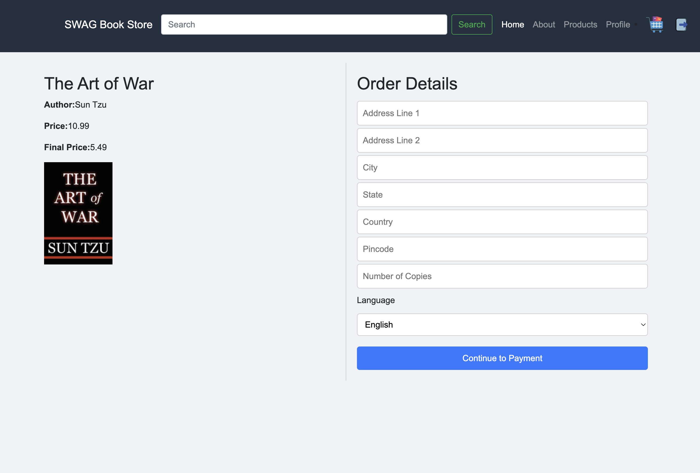
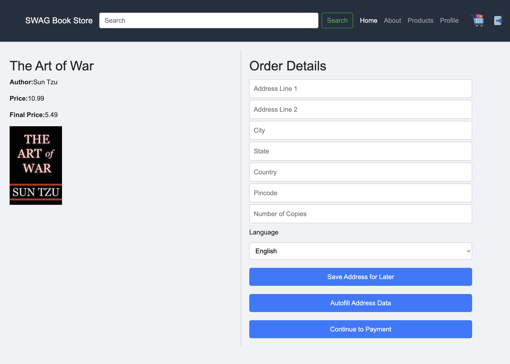
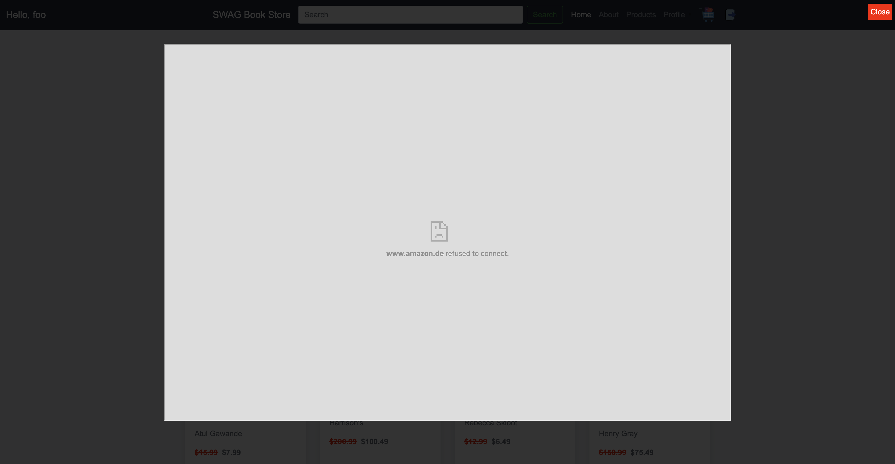
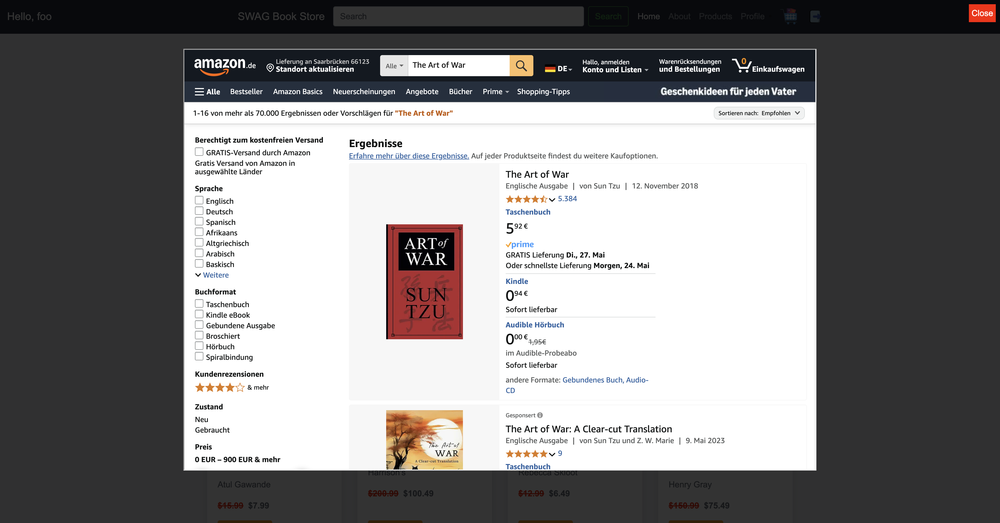

## _I have no idea how to make it safer_: Studying Security and Privacy Mindsets of Browser Extension Developers

### Artifacts for Coding Tasks

Here, we provide the browser extensions associated with each of the coding tasks (refer to §4.2 in the original papers for more details) that we also share with our study participants, as is, including the following:
- DOM-interaction logic for CT1 to enable UI functionalities around the _Autofill Feature_.
- UI Elements and iframe-injection logic for CT2 to allow loading _Amazon_ within an iframe.
- Facebook Share plugin for the optional CT3 to allow sharing.
- Stylesheets and customization for better UI controls.

**Note**: The existing scripts and logic within each individual extension were only intended to reduce the burden of implementing the entire functionality from scratch, and are entirely agnostic to the task-based requirements.

### Loading an Unpacked Extension in Chrome

To load any of the provided browser extensions from the directories inside this folder into Chrome:

1. **Open Google Chrome.**
2. Navigate to `chrome://extensions` in the address bar.
3. Enable **Developer mode** (toggle in the top right corner).
4. Click on **Load unpacked**.
5. In the file dialog, select the directory of the extension you want to load (e.g., `primary/task1`, `primary/task2`, or `additional/task3` inside this folder).
6. The extension should now appear in your list of installed extensions.

**Note:** If you make changes to the extension files, click the **Reload** button on the extension card in `chrome://extensions` to apply updates.

### Loading an Unpacked Extension in Mozilla Firefox

To load any of the provided browser extensions in Mozilla Firefox:

1. **Open Mozilla Firefox.**
2. Navigate to `about:debugging#/runtime/this-firefox` in the address bar.
3. Click on **Load Temporary Add-on...**.
4. In the file dialog, select the `manifest.json` file inside the extension directory you want to load (e.g., `primary/task1/manifest.json`).
5. The extension will be loaded temporarily and appear in your list of extensions for the current session.

**Note:** Extensions loaded this way are temporary and will be removed when you restart Firefox. To reload after changes, repeat the steps above.

---

### Coding Task 1
In this task, the participants were required to enable the _Autofill_ functionality for the E-Commerce application through a browser extension. The browser extension added additional UI elements on the "Purchase/Order" page, as shown below:

The "Purchase/Order" page before loading the extension.

The "Purchase/Order" page after loading the extension. Two new UI buttons are introduced to 'Save/Autofill' address data. The corresponding logic was required to be implemented by the participants.

---

### Coding Task 2

In this task, the participants were required to enable embedding of a cross-origin domain – _Amazon_, within an iframe, to check and compare product prices, as shown below:

The "Product" page before loading the extension.

Once the extension is loaded, it introduces a new button – _Check on Amazon_, next to the "Order Now" for each of the listed products. However, when clicked, the iframe does not load due to the `X-Frame-Options` header set to `SAMEORIGIN` by _Amazon_, as shown below:

The iframe is expected to load the _Amazon_ price with the search query set to the product/book title, as above.

---

### Coding Task 3 (Optional)
Lastly, the participants were asked to enable a Facebook Share plugin for each product listed on the product page of the E-Commerce application, as shown below:

The "Product" page before and after loading the extension – the functionality is blocked by the original CSP header, and thus, no visible changes. However, the issues are reflected in the console.

The "Product" page now contains the "Facebook Share Plugin/Button" next to the "Order Now" button for each of the listed items to enable sharing them.